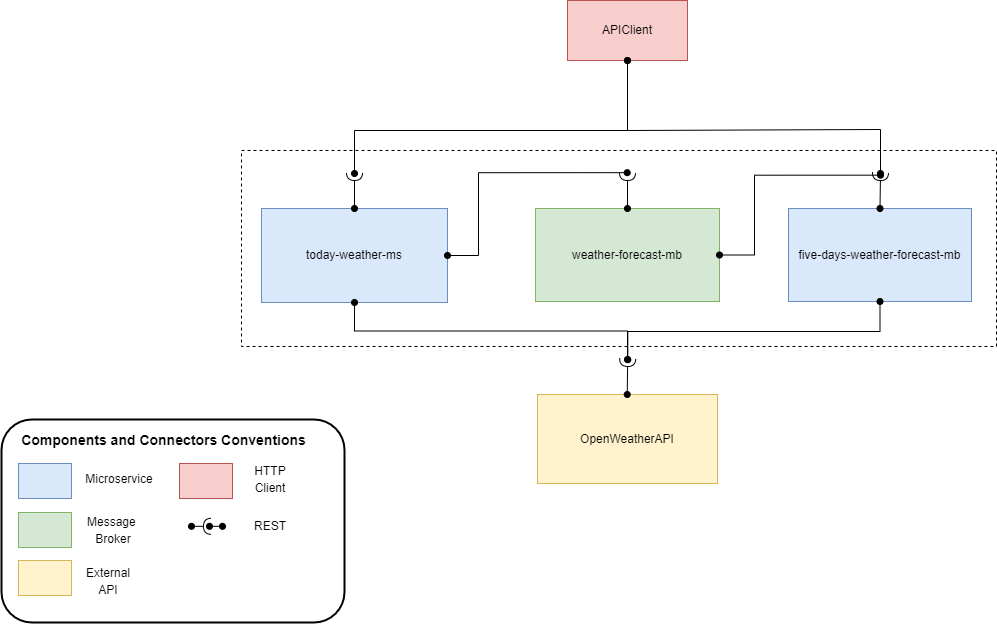

# Superpesos' Backend Task

## Architecture:

## Folder Structure:

The internal structure of each component is the following:

- **{component_name}**: the root folder of the component which contains the *.env* file, *package.json*, and other needed files aside from the code, and *node_modules* folder 
  - **src**: Here resides the code, *index.js* and *app.js* files, where the Express server is set up
    - **errors**: Contains different required types of errors along with their status codes and messages
    - **logging**: Defines the logger implementation
    - **routes**: Here the endpoints and their logic are defined
      - **\_\_test\_\_**: Contains the tests of the endpoints

## Setup:

- `cd` into the folder of the specific component
- Run `npm install`
- If you want to deploy the server, run `npm run start`
- If you want to run the tests, run `npm run test`
- In the *.env* file of each component, you can change URL and PORTs parameters when needed. Be sure to provide valid values

## API Requests:

### Query the weather information of a city in the current day:

**GET** request to `http://127.0.0.1:3001/api?city={city_name}`

### Query the weather information of a city in the current day AND the forecast of the weather in the next five days:

**GET** request to `http://127.0.0.1:3001/api?city={city_name}&forecast=true`

### Query the forecast of the weather in the next five days:

**GET** request to `http://127.0.0.1:3002/api?city={city_name}`
